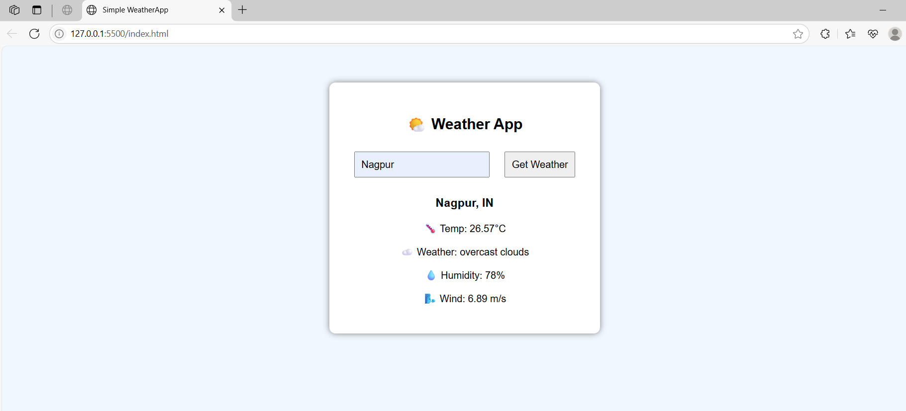

# 🌤️ WeatherApp – Task 5 (Internship @ Prodigy Infotech)

This is **Task 5** of my internship at **Prodigy Infotech**, where I created a simple and clean **Weather App** using **HTML, CSS, and JavaScript**. The app allows users to enter any city name and fetches real-time weather data from the **OpenWeatherMap API**.

---

## ✨ Features

- 🔎 Search weather by entering a city name (e.g., Nagpur)
- 🌡️ Displays:
  - Temperature (°C)
  - Weather conditions (clear, cloudy, etc.)
  - Humidity (%)
  - Wind speed (m/s)
- ⚡ Beginner-friendly and responsive design

---

## 🛠️ Technologies Used

- HTML5
- CSS3
- JavaScript (Vanilla)
- OpenWeatherMap API

---

## 🚀 How to Run

1. Clone or download the repository.
2. Open `index.html` in any browser.
3. Enter a city name (like **Nagpur**) and click "Get Weather".

---

## 🔐 Setup Instructions

1. Get a free API key from [OpenWeatherMap](https://openweathermap.org/api).
2. Open `script.js` and replace this line:

const apiKey = "YOUR_API_KEY";
with your actual API key.

📸 Sample Screenshot

📌 Note
This project was developed as part of my internship at Prodigy Infotech and is named "WeatherApp – Task 5".
